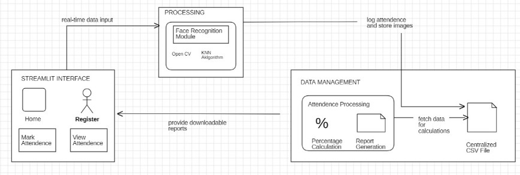

📸 Automatic Attendance System Using Face Recognition

👥 Team Members

Anamika Singh (Team Leader)

Afreen Ahmed

Jupally Meena

📖 Project Overview

This project automates attendance marking using Face Recognition. It eliminates manual roll-calls, prevents proxy attendance, and provides real-time tracking with a user-friendly interface.

The system is built using:

Python (OpenCV, NumPy, Scikit-learn, Pandas)

Machine Learning (K-Nearest Neighbors - KNN)

Streamlit for the web interface

🚩 Problem Statement

Manual/RFID attendance is time-consuming & prone to proxy attendance.

No real-time tracking or analytics.

Existing systems lack scalability, automation, and seamless identity verification.

✨ Key Features

✔️ Student facial registration with automatic image capture (30–40 images per student)

✔️ Real-time face recognition via webcam

✔️ Attendance saved in CSV/Excel (with Name, Roll No, Branch, Date, Time

✔️ Date-wise attendance reports with % calculation

✔️ Downloadable reports in Excel format

✔️ Streamlit-based UI with navigation (Home, Register, Mark Attendance, View Attendance)

✔️ Scalable for schools, colleges, corporate offices, and more

🏗️ System Architecture

 

🖥️ Screenshots

🔹 Home Page

 

🔹 Registration Page

 

🔹 Mark Attendance

 

🔹 Attendance Report

 

🛠️ Tech Stack

Frontend/UI: Streamlit

Backend: Python

Libraries: OpenCV, Pandas, NumPy, Scikit-learn, Dlib

Storage: CSV/Excel

⚡ How to Run
# Clone the repository
git clone https://github.com/yourusername/face-recognition-attendance.git

# Navigate to the project folder
cd face-recognition-attendance

# Create virtual environment (optional but recommended)
python -m venv env
source env/bin/activate   # for Linux/Mac
env\Scripts\activate      # for Windows

# Install dependencies
pip install -r requirements.txt

# Run the app
streamlit run app.py

📊 Results

Achieved 80%+ accuracy with KNN-based recognition.

Attendance marked in 1–2 seconds per student.

User-friendly interface with Excel-based reports.

🚀 Future Enhancements

✅ Replace KNN with Deep Learning (CNN, ArcFace, InsightFace)

✅ Mobile App Integration

✅ Cloud Storage & Multi-user support

✅ Real-time alerts via Email/WhatsApp

✅ Blockchain for secure data storage

📝 Conclusion

The Face Recognition Attendance System is a contactless, automated, and accurate solution to manage attendance. With scalability and future integration potential, it is suitable for educational institutions, corporate offices, and large organizations.
